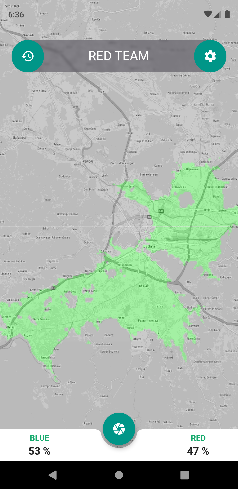
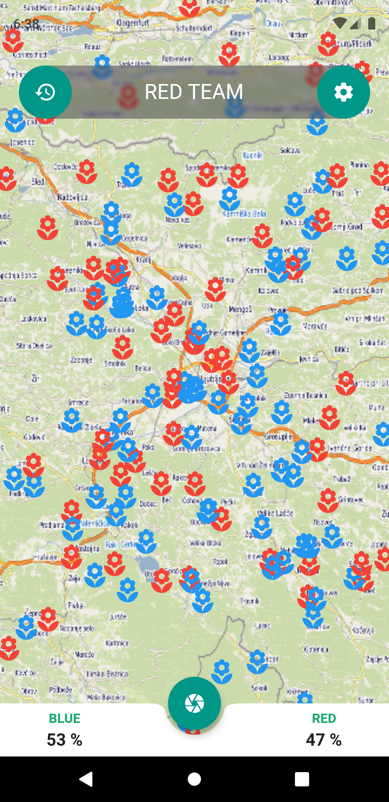
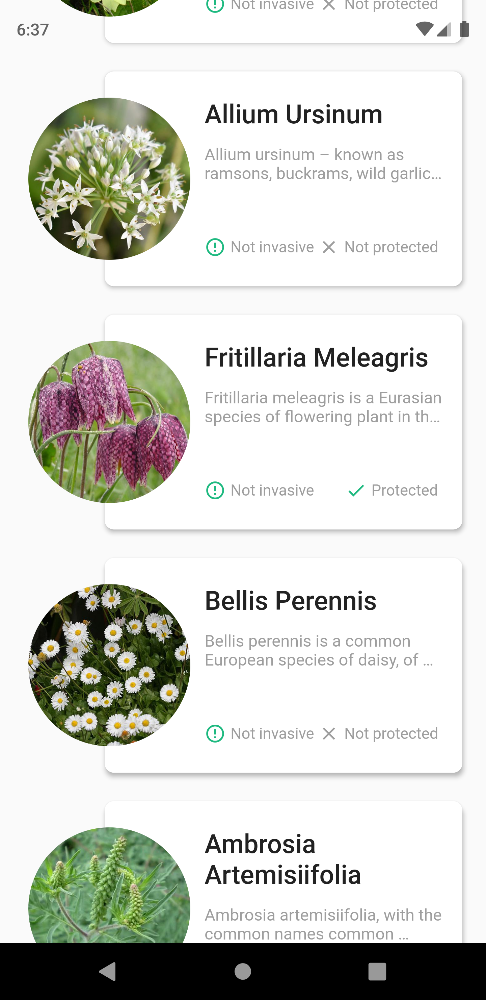
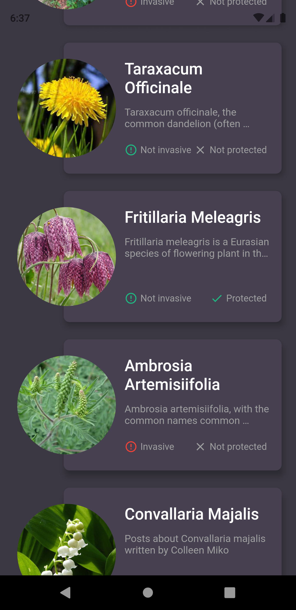
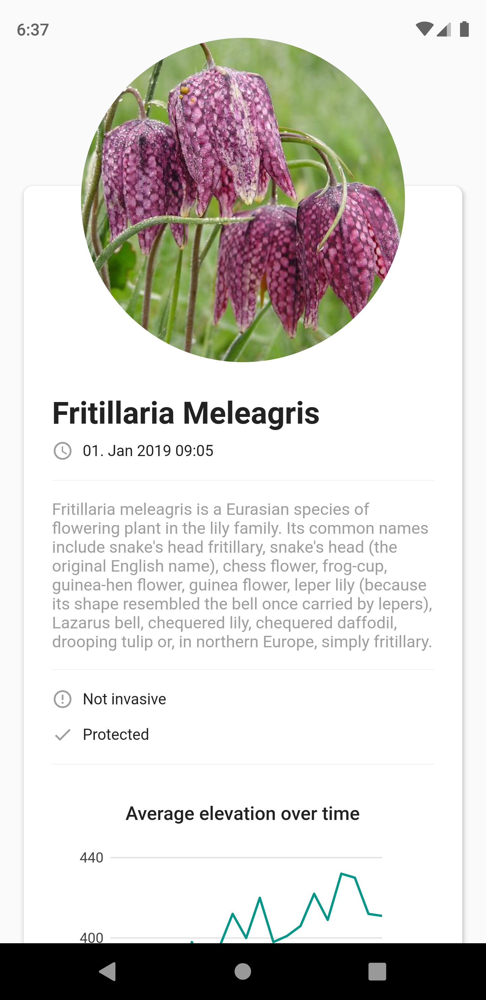

# Dragonhack 2019
Dragonhack 2019 project that won Best Earth Observation Hack challenge

We developed a biodiversity data collection framework, which incentivizes its users to collect data through the gamification of the process. The data is analyzed in real time using machine learning and satellite imagery, which gives instant feedback to the user regarding the invasiveness and conservation status.

## Screenshots

